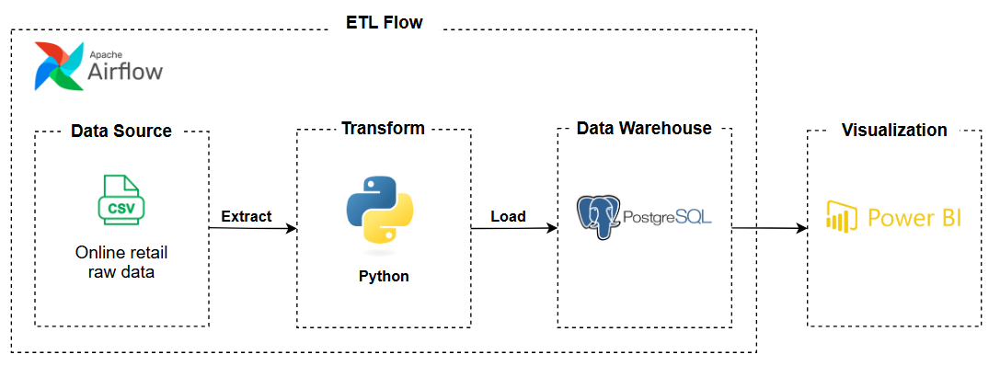
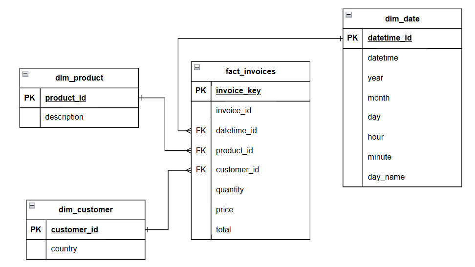
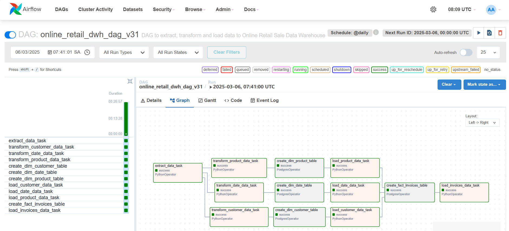
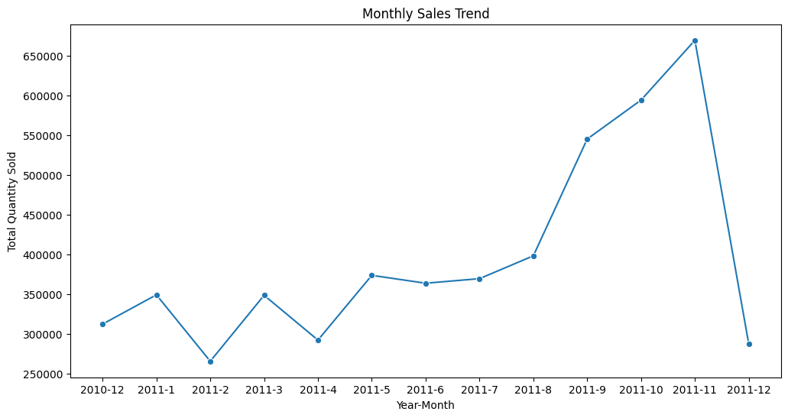
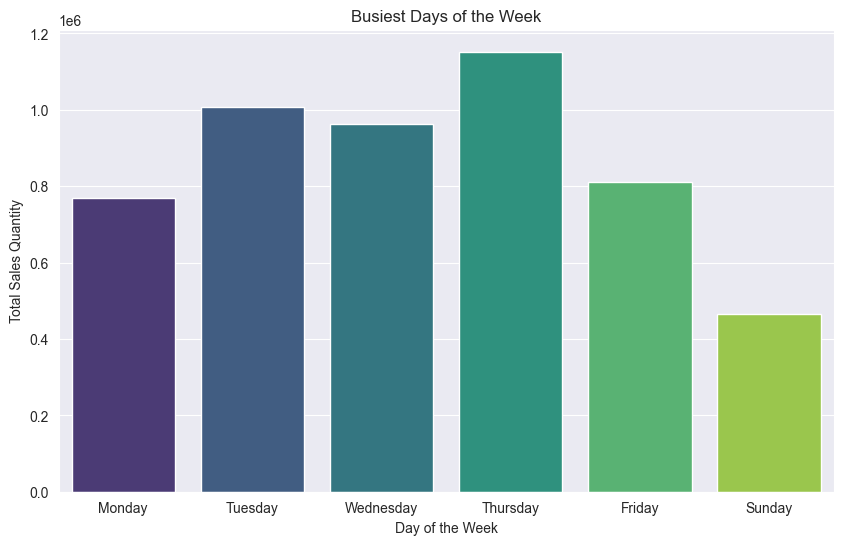
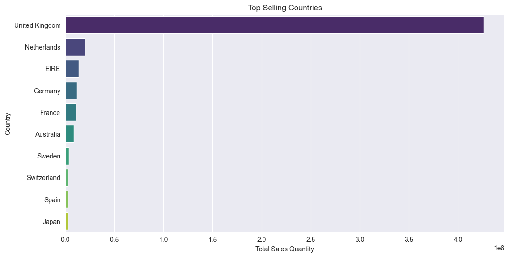
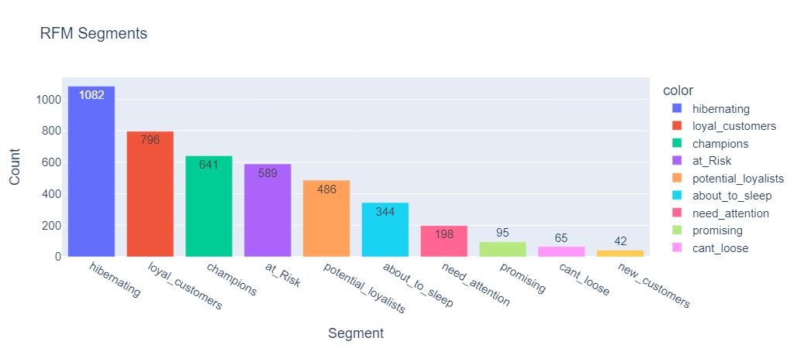
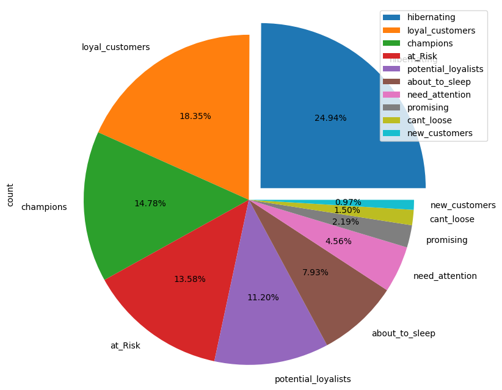
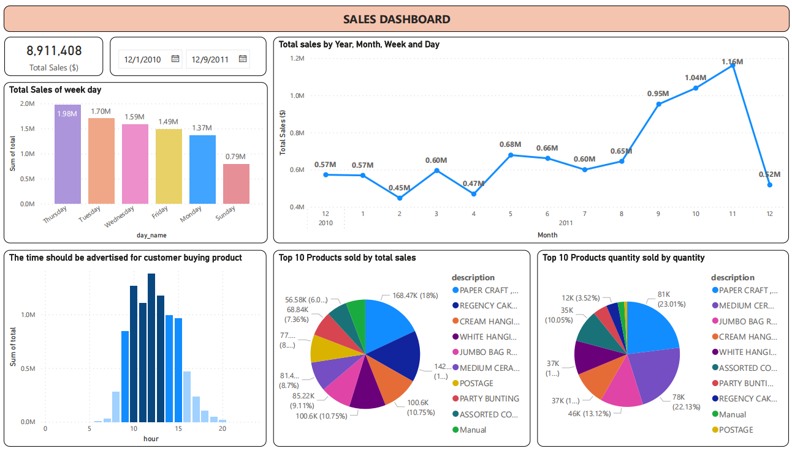
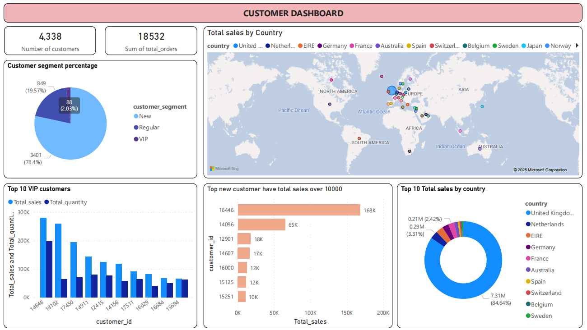

# Building Data Warehouse and ETL pinelines with Airflow Project

### Set up Environments
1. Airflow with Docker
   - Download docker-compose.yaml file.
   - Create folder: mkdir -p ./dags, ./logs, ./plugins, ./config
   - Init docker with airflow: docker compose up airflow-init
   - Running Airflow: docker compose up -d
   - Check docker running: docker ps

# Online Retail Data Pipeline Project

## 📊 Project Overview
This project focuses on building a complete **data pipeline** for the [Online Retail dataset](https://www.kaggle.com/datasets/tunguz/online-retail?resource=download). The goal is to extract, transform, and load (ETL) the dataset into a PostgreSQL data warehouse and visualize the insights using Python & Power BI. Apache Airflow is used to orchestrate and automate the data pipeline.

## 🔬 Architecture


## 📝 Data Modeling


## 🛠️ Technology Stack
- **Apache Airflow**: Workflow orchestration for managing ETL processes.
- **Python**: Data extraction, transformation, loading and analysis.
- **PostgreSQL**: Data warehouse for storing processed data.
- **Power BI**: Data visualization and reporting.

## 📊 Dataset Information
- **Source**: [Online Retail Dataset](https://www.kaggle.com/datasets/tunguz/online-retail?resource=download)
- **Description**: Transactions from a UK-based online retailer between 2010-2011.
- **Key Columns**:
    - `InvoiceNo`: Unique identifier for each transaction
    - `StockCode`: Product code
    - `Description`: Product name
    - `Quantity`: Number of products purchased
    - `InvoiceDate`: Date of purchase
    - `UnitPrice`: Price per product
    - `CustomerID`: Unique customer identifier
    - `Country`: Customer's country

## 📌 Project Workflow
- Airflow ETL pineline

1. **Extract**: Download and extract data from the Kaggle dataset.
2. **Transform**: Clean and preprocess the data (e.g., handling missing values, data type conversion).
3. **Load**: Load the processed data into a PostgreSQL data warehouse.
4. **Visualize**: Build interactive dashboards using Power BI & Python.

## 📁 Project Structure
```
├── analysis/            # Data analysis with Python
│    └── data_analysis.ipynb
├── dags/                # Airflow DAGs
│    ├── data/raw/       # Raw data
│    │    └── Online_Retail.csv
│    └── ETL_dag.py
├── dashboard/           # Power BI dashboard
│    └── dashboard_powerbi.pbix
├── images/              # Project images
├── sql_scripts/         # SQL scripts for analysis, report
│    ├── AnalysisQueryScripts.sql
│    └── CustomerReportScripts.sql
├── docker_compose.yaml  # Docker config
└── README.md            # Project documentation
```

## 📊 Data analysis with Python
- Monthly Sales Trend
  

- Busiest Days of the Week
  

- Top-Selling Products By Country
  

- RFM Analysis
  
  

## 📊 Power BI Dashboard
- Sales Dashboard
  

- Customer Dashboard
  
- Import the processed data from PostgreSQL into Power BI.

## 📞 Contact
For questions or suggestions, reach out via nguyenquangphuc412@gmail.com